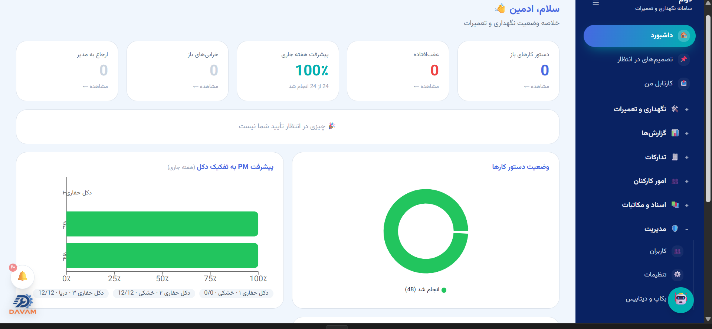
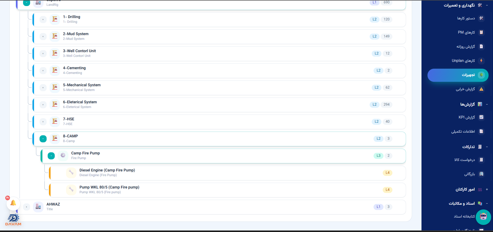
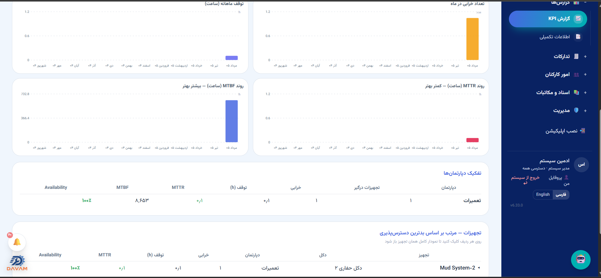
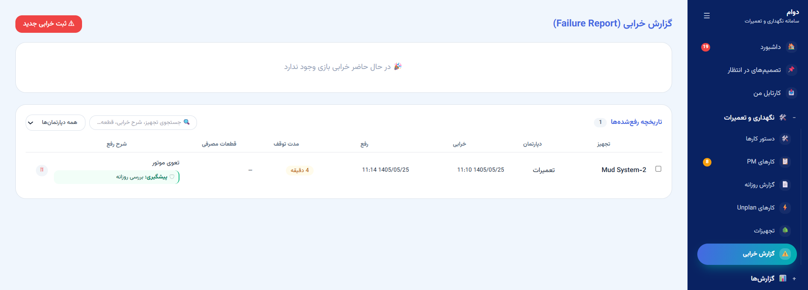
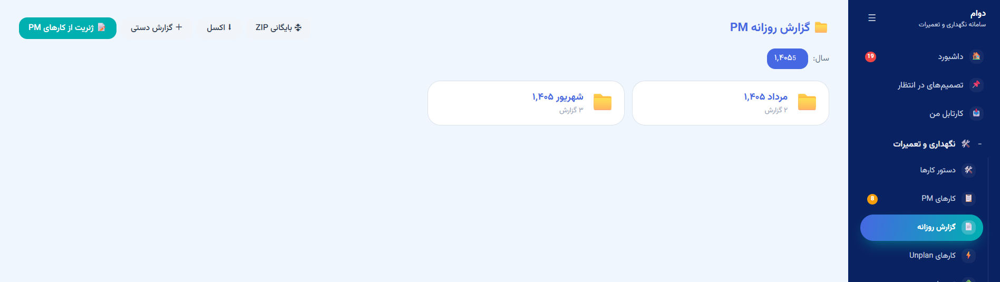
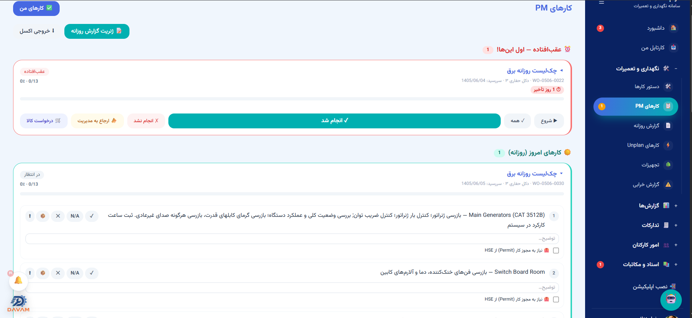

<div align="center">

# دوام

**سامانه‌ی یکپارچه‌ی نگهداری و تعمیرات دکل‌های حفاری**

نسخه‌ی فارسی · [English](README.en.md) · [صفحه‌ی معرفی](https://m0000hamad.github.io/davam-showcase/)


</div>

---

## دوام چیست

دوام یک سامانه‌ی **CMMS/PMS** تحت وب است که برای مدیریت نگهداری و تعمیرات
دکل‌های حفاری ساخته شده و جایگزین بومیِ یک سامانه‌ی ERP خارجی در یک شرکت
حفاری فعال است.

سامانه امروز روی سه دکل در حال بهره‌برداری است و در **۱۲۱ نسخه‌ی منتشرشده**
از یک ماژول ورود ساده به یک سامانه‌ی سازمانی کامل رسیده — از درخت تجهیزات و
دستور کار تا نامه‌نگاری اداری، انبار، تدارکات، امور کارکنان و گزارش‌های
مدیریتی.

> کد این سامانه **خصوصی** است. این صفحه فقط برای معرفی و مستندات نصب است.

---

## نماهایی از سامانه

| | |
|---|---|
|  |  |
| **داشبورد مدیریتی** — کارهای باز و عقب‌افتاده، پیشرفت PM به تفکیک دکل | **درخت تجهیزات** — سلسله‌مراتب تا شش سطح، با کد فنی و مدل هر آیتم |
|  |  |
| **گزارش KPI** — MTBF و MTTR و دسترس‌پذیری، با روند ۱۲ ماهه | **گزارش خرابی** — مدت توقف، قطعات مصرفی، شرح رفع و پیشگیری |
|  |  |
| **ساخت گزارش روزانه** — از خودِ کارهای PM، به تفکیک دپارتمان | **کارهای PM** — کارتابل تکنسین، با خروجی اکسل |

<sub>نمای بیشتر در [صفحه‌ی معرفی](https://m0000hamad.github.io/davam-showcase/).</sub>

---

## یک روز کاری در دوام

بهترین توضیح دوام، دنبال‌کردن یک روز واقعی است:

**شب قبل**، سامانه بر اساس برنامه‌های PM و تقویم شمسی، دستور کارهای فردا
را خودش می‌سازد. کسی لازم نیست چیزی را دستی باز کند.

**صبح**، هر تکنسین «کارتابل من» را باز می‌کند و فقط کارهای خودش و دکل
خودش را می‌بیند. چک‌لیست هر کار همان‌جا باز می‌شود — مثلاً برای چک‌لیست
روزانه‌ی برق: بازرسی ژنراتورها، کنترل بار، اتاق تابلو، فن‌ها و فیلترهای
VFD، موتورهای پمپ گِل. هر آیتم یکی از این حالت‌ها را می‌گیرد: انجام شد،
نیازی نبود، انجام نشد، نیاز به کالا، ارجاع به مدیریت.

**اگر کاری عقب بیفتد**، سامانه اجازه‌ی بستنش را بدون **دلیل تأخیر**
نمی‌دهد. این تنها راهی است که گزارش تأخیر واقعی می‌ماند و به «همه‌چیز
سبز» تبدیل نمی‌شود.

**اگر تجهیزی خراب شود**، خرابی با زمان شروع و پایان ثبت می‌شود؛ سامانه
خودش **مدت توقف** را حساب می‌کند و قطعات مصرفی، شرح رفع و اقدام پیشگیرانه
را نگه می‌دارد. همین‌ها هستند که بعداً MTBF و MTTR را می‌سازند.

**آخر روز**، گزارش روزانه از خودِ کارهای PM ساخته می‌شود — به تفکیک
دپارتمان، با شمارش هر وضعیت. گزارش **لحظه‌ی ثبت** قفل می‌شود و با تغییر
بعدی کارها عوض نمی‌شود، چون یک گزارش امضاشده نباید بازنویسی شود.

**آخر ماه**، گزارش‌ها در پوشه‌های سال و ماه شمسی بایگانی می‌شوند و
یک‌جا به‌صورت ZIP یا اکسل قابل تحویل‌اند.

---

## چه کاری می‌کند

### 🛠 نگهداری و تعمیرات — قلب سامانه

**🌳 شناسنامه‌ی دقیق ناوگان.** تجهیزات در یک سلسله‌مراتب چندسطحی تعریف
می‌شوند — از دکل تا کوچک‌ترین قطعه‌ی قابل تعویض — و هر آیتم کد فنی، مدل و
سابقه‌ی خودش را دارد. ساختار موجود سازمان به‌صورت انبوه از اکسل وارد
می‌شود، پس راه‌اندازی به ورود دستی هزاران رکورد نیاز ندارد.

**📅 برنامه‌ریزی نگهداری پیشگیرانه روی تقویم شمسی.** دوره‌های روزانه،
هفتگی و ماهانه تعریف می‌شوند و سامانه **هر شب خودش** دستور کار روز بعد
را می‌سازد. برنامه‌ها و چک‌لیست‌هایشان از فایل قابل ایمپورت، ویرایش و
بازنشانی‌اند.

**🔧 چرخه‌ی کامل دستور کار.** هر کار شماره‌ی یکتا می‌گیرد، چک‌لیست اجرایش
همان‌جا باز می‌شود و هر آیتم وضعیت دقیق می‌گیرد — از «انجام شد» تا «نیاز
به کالا» و «ارجاع به مدیریت». ساخت گروهی و کپی دسته‌ای برای برنامه‌های
تکرارشونده پشتیبانی می‌شود.

**⛔ انضباط تأخیر — قابلیتی که گزارش را صادق نگه می‌دارد.** کار
عقب‌افتاده **بدون ثبت دلیل تأخیر بسته نمی‌شود**. این تنها چیزی است که
نمی‌گذارد گزارش ماهانه به یک صفحه‌ی تماماً سبزِ بی‌معنا تبدیل شود.

**⚠️ مدیریت خرابی و توقف.** خرابی با زمان شروع و پایان ثبت می‌شود و
**مدت توقف خودکار محاسبه** می‌گردد. قطعات مصرفی، شرح رفع و اقدام
پیشگیرانه نگه داشته می‌شوند — همان داده‌ای که بعداً بدون دخالت انسان
تبدیل به شاخص‌های قابلیت اطمینان می‌شود. کارهای برنامه‌ریزی‌نشده هم مسیر
خودشان را دارند ولی در همان گزارش‌ها دیده می‌شوند.

**📄 گزارش روزانه‌ای که خودش را می‌سازد.** گزارش از خودِ کارهای انجام‌شده
تولید می‌شود، به تفکیک دپارتمان تفکیک می‌خورد و **در لحظه‌ی ثبت قفل
می‌شود** — چون یک گزارش امضاشده نباید با تغییر بعدی کارها بازنویسی شود.
بایگانی ماهانه‌ی ساختاریافته و تحویل یک‌جا هم پشتیبانی می‌شود.

### 📊 گزارش و شاخص‌ها

**📈 شاخص‌های استاندارد قابلیت اطمینان.** سامانه **MTBF**، **MTTR** و
**دسترس‌پذیری** را همراه با تعداد خرابی، ساعت توقف و تعداد تجهیزات درگیر
محاسبه می‌کند — قابل تفکیک بر اساس دکل، دپارتمان و بازه‌ی زمانی تا یک
سال. این اعداد دستی وارد نمی‌شوند؛ از همان ثبت روزمره‌ی خرابی‌ها بیرون
می‌آیند.

**🚦 هشدار زودهنگام با آستانه‌ی رنگی.** روند دسترس‌پذیری ناوگان روی
محدوده‌های تعریف‌شده نمایش داده می‌شود، پس افت عملکرد **قبل از بحرانی
شدن** دیده می‌شود، نه بعد از آن.

**📗 خروجی اکسل حرفه‌ای از هر فهرست.** خروجی چک‌لیست نگهداری هر دپارتمان
را در شیت جداگانه می‌چیند، وضعیت هر آیتم را علامت می‌زند و سررسید و دلیل
تأخیر را هم می‌آورد. بازه‌ی زمانی کاملاً انعطاف‌پذیر است — از یک روز
مشخص تا اکسپورت کلی — و همه بر پایه‌ی تقویم شمسی.

### زنجیره‌ی تأمین — از نیاز تا تسویه

**درخواست کالای پیشرفته با رهگیری دقیق.** هر درخواست از لحظه‌ی ثبت تا
تحویل کالا قابل ردیابی است و در هر لحظه معلوم است روی میز چه کسی مانده.
گردش تأیید چندمرحله‌ای است و **شرط مبلغی** دارد: خریدهای کوچک مسیر
کوتاه‌تری می‌روند و فقط از سقف مشخصی به بالا تأیید مالی لازم می‌شود.

**تشخیص گلوگاه، نه فقط ثبت سفارش.** سامانه خط خرید را به‌صورت مراحل
پشت‌سرهم نشان می‌دهد و انگشت می‌گذارد روی جایی که کار واقعاً معطل شده —
منتظر خرید، منتظر تأیید، منتظر رسید یا منتظر فاکتور. مدیر لازم نیست
دنبال کسی بگردد.

**کنترل تطبیقی سه‌جانبه.** سفارش، رسید انبار و فاکتور با هم مقایسه
می‌شوند و مغایرت خودکار علامت می‌خورد؛ تعهد باز پس از تأیید مبلغی به
هزینه‌ی قطعی تبدیل می‌شود و در دفتر هزینه می‌نشیند.

**مدیریت انبار با تاریخچه‌ی کامل.** موجودی چند انبار، کالای در راه، و
تاریخچه‌ی گردش هر قلم به‌صورت کاردکس نگه داشته می‌شود. اقلام تعمیرپذیر و
گارانتی‌دار مسیر خودشان را دارند، و مصرف قطعات مستقیم به هزینه‌ی نگهداری
همان تجهیز وصل می‌شود.

**کنترل مالی و بودجه** با پشتیبانی چندارزی و نرخ ارز قابل تنظیم، به‌همراه
مدیریت تنخواه هر دکل. سامانه با انبار مرکزی سازمان هم یکپارچه می‌شود، پس
لازم نیست داده دو جا نگهداری شود.

### اداری و کارکنان — کاغذبازی، بدون کاغذ

**نامه‌نگاری اداری کامل.** نامه با سربرگ رسمی سازمان ساخته می‌شود،
شماره‌ی اتوماتیک می‌گیرد، مسیر تأییدش را طی می‌کند و با امضای اسکن‌شده‌ی
امضاکننده مهر می‌شود. گیرنده‌ی داخلی و خارج از سازمان، رونوشت، پیوست،
درجه‌ی محرمانگی و فوریت همه پشتیبانی می‌شوند؛ و صندوق دریافتی وضعیت
خوانده‌شدن و اقدام را نگه می‌دارد. خروجی نهایی قابل چاپ و بایگانی است.

**بایگانی سازمان‌یافته‌ی اسناد** با دسته‌بندی و جست‌وجو، تا مدرک فنی و
اداری در یک جای مشخص بماند نه در ایمیل آدم‌ها.

**فرآیندهای منابع انسانی** — مرخصی، مأموریت و سفر، فیش حقوقی و پشتیبانی
داخلی — همه روی **یک موتور گردش کار مشترک** اجرا می‌شوند. یعنی قواعد
تأیید یک بار تعریف می‌شود و همه‌ی فرآیندها از آن پیروی می‌کنند؛ اضافه‌شدن
یک فرآیند جدید نیازی به بازنویسی منطق تأیید ندارد.

**موتور تأیید قابل پیکربندی** که مرحله‌ها را بر اساس نقش، دپارتمان،
مدیر مستقیم یا شرط مبلغی تعیین می‌کند، مهلت پاسخ (SLA) می‌گذارد و
مرحله‌های غیرضروری را خودش رد می‌کند.

### 🧩 زیرساخت و تجربه‌ی کاربری

**🌐 دوزبانگی واقعی، نه ترجمه‌ی سطحی.** فارسی راست‌چین و English چپ‌چین
با تعویض آنی — و مهم‌تر: جهت صفحه، تقویم، قالب اعداد و حتی **خروجی‌های
چاپی و PDF** هم با زبان عوض می‌شوند.

**🔐 دسترسی چندلایه با جداسازی داده.** علاوه بر نقش‌های سازمانی، داده
**بر اساس دکل ایزوله می‌شود**: کاربر هر دکل فقط داده‌ی همان دکل را
می‌بیند و مدیر چند دکل، فقط دکل‌های تحت نظر خودش. دسترسی به هر بخش هم
جداگانه قابل کنترل است.

**📥 کارتابل شخصی و صف تصمیم‌ها.** هر کاربر در یک نگاه می‌بیند چه چیزی
منتظر اقدام اوست — بدون گشتن در بخش‌های مختلف.

**🎨 برندپذیری کامل.** نام و لوگوی شرکت، رنگ‌های سامانه، صفحه‌ی ورود و
سربرگ نامه‌ها همه از داخل پنل تنظیم می‌شوند. سامانه با هویت بصری هر
سازمان بالا می‌آید، نه با یک ظاهر ثابت.

**💾 بکاپ خودکار شبانه و بازیابی از داخل پنل.** تعداد نسخه‌های نگهداری
قابل تنظیم است و بازیابی بدون دسترسی به سرور انجام می‌شود.

**🔔 اعلان چندکاناله** روی پیام‌رسان‌ها و ایمیل، تا کار پشت گردش تأیید
معطل نماند.

**🤖 دستیار هوشمند** که به زبان طبیعی به سؤال‌هایی مثل «چند دستور کار باز
داریم؟» یا «وضعیت پمپ گِل شماره ۱ چیست؟» جواب می‌دهد. عمداً **فقط
می‌خواند** — هیچ‌وقت چیزی ثبت یا ارسال نمی‌کند.

**📱 روی موبایل و دسکتاپ.** علاوه بر مرورگر، به‌صورت اپلیکیشن روی موبایل
نصب می‌شود و نسخه‌ی دسکتاپ مستقل هم دارد.

---

## معماری

```
                       ┌──────────────┐
   مرورگر / دسکتاپ ───▶│  nginx (web) │  React 18 + TypeScript + Tailwind
                       └──────┬───────┘  RTL/LTR · Vazirmatn · تقویم شمسی
                              │ /api
                       ┌──────▼───────┐
                       │  FastAPI     │  ۳۷ ماژول · JWT · RBAC · APScheduler
                       └──────┬───────┘
                              │
                       ┌──────▼───────┐
                       │ PostgreSQL16 │  والیوم‌های pgdata · uploads · backups
                       └──────────────┘
```

| لایه | فناوری |
|---|---|
| فرانت‌اند | React 18، TypeScript، Tailwind CSS، Vite، Recharts |
| بک‌اند | FastAPI، SQLAlchemy 2، Pydantic v2، APScheduler، PyJWT |
| دیتابیس | PostgreSQL 16 |
| استقرار | Docker Compose یا نصب مستقیم روی systemd + nginx |
| دسکتاپ | Tauri |

---

## پیش‌نیازها

| مورد | حداقل | توضیح |
|---|---|---|
| سیستم‌عامل | Ubuntu 22.04 یا 24.04 (۶۴ بیتی) | نصاب برای همین دو نسخه آزموده شده |
| پردازنده | ۲ هسته | ساخت ایمیج سنگین‌ترین مرحله است |
| حافظه | ۲ گیگابایت | نصب تولیدی فعلی روی همین مقدار اجرا می‌شود |
| دیسک | ۲۰ گیگابایت آزاد | رشد آن به حجم پیوست‌ها و بکاپ‌ها بستگی دارد |
| دسترسی | کاربر `root` یا `sudo` | |
| شبکه | پورت ۸۰۸۰ (یا پورت دلخواه شما) باز | برای HTTPS پورت ۸۰ و ۴۴۳ |
| اینترنت سرور | لازم | برای دریافت بسته، ایمیج‌ها و کتابخانه‌ها |

**توکن دسترسی**: چون مخزن نسخه‌ها خصوصی است، نصب به یک توکن فقط‌خواندنی
نیاز دارد. **برای هر نصب یک توکن جداگانه صادر می‌شود** تا در صورت نیاز
بتوان همان یکی را باطل کرد بدون اینکه بقیه‌ی نصب‌ها مختل شوند. توکن را از
تیم دوام بگیرید.

توکن روی سرور در `/etc/davam/token` با دسترسی `600` و مالکیت `root`
می‌نشیند — نه در `.env`. دلیلش این است که `.env` را کانتینر برنامه هم
می‌خواند، و توکن مخزن نباید در دسترس فرآیندی باشد که به اینترنت پاسخ
می‌دهد.

---

## نصب

نصب کاملاً از طریق **API گیت‌هاب** انجام می‌شود — نیازی به آپلود دستی فایل
نیست. دو روش نصب وجود دارد و هر دو از یک اسکریپت واحد اجرا می‌شوند.

### گام ۱ — گرفتن اسکریپت نصب

```bash
export DAVAM_GH_TOKEN='توکنی-که-گرفته‌اید'

curl -fsSL \
  -H "Authorization: Bearer $DAVAM_GH_TOKEN" \
  -H "Accept: application/vnd.github.raw" \
  https://api.github.com/repos/m0000hamad/davam/contents/davam.sh \
  -o davam.sh
```

### گام ۲ — اجرای منو

```bash
bash davam.sh
```

منوی نصب و مدیریت باز می‌شود:

```
════════ دوام — نصب و مدیریت ════════
  مسیر: /root/pms
  نسخه: نصب‌نشده        روش نصب: نامشخص

  ── نصب ──
   1) نصب با داکر  (پیشنهادی)
   2) نصب مستقیم روی سرور  (بدون داکر)

  ── بروزرسانی ──
   3) بررسی نسخه‌ی جدید
   4) بروزرسانی به آخرین نسخه
   5) بروزرسانی به نسخه‌ی مشخص
   6) نمایش تغییرات
  …
```

گزینه‌ی ۱ یا ۲ را بزنید. اسکریپت پیش‌نیازها را خودش نصب می‌کند، آخرین
نسخه را از گیت‌هاب می‌گیرد، پسورد دیتابیس و کلید امنیتی را **تصادفی**
می‌سازد، فایروال را تنظیم می‌کند و در پایان آزمون پذیرش می‌گیرد.

### کدام روش؟

| | **داکر** (پیشنهادی) | **مستقیم** |
|---|---|---|
| ایزولاسیون | کامل — سه کانتینر جدا | روی خود سیستم‌عامل |
| پیش‌نیاز اضافه | داکر | PostgreSQL، Python، nginx از مخازن apt |
| Node روی سرور | لازم نیست | لازم نیست¹ |
| Adminer (مدیریت DB از مرورگر) | ✅ | ❌ |
| مناسب برای | اکثر موارد | سرورهایی که داکر ممنوع/ناممکن است |

<sub>¹ بسته‌های انتشار، فرانت‌اند را از قبل ساخته‌شده در خود دارند.</sub>

### نصب بی‌صدا (بدون منو)

```bash
DAVAM_GH_TOKEN='…' bash davam.sh install-docker    # یا install-direct
```

### پس از نصب

آدرس، نام کاربری و رمز اولیه در پایان نصب چاپ می‌شوند.
**بلافاصله پس از اولین ورود رمز مدیر را عوض کنید.**

گام‌های اختیاری:

```bash
bash davam.sh ssl example.com you@mail.com   # دامنه و HTTPS
bash davam.sh autobackup                     # بکاپ خودکار روزانه
bash davam.sh agent-install                  # فعال‌سازی بروزرسانی از داخل برنامه
```

---

## بروزرسانی

داده‌ها در همه‌ی روش‌ها حفظ می‌شوند: دیتابیس، پیوست‌ها و فایل `.env` هرگز
بازنویسی نمی‌شوند و **پیش از هر بروزرسانی خودکار بکاپ گرفته می‌شود**.

### ۱) از داخل خود برنامه

**تنظیمات ← بروزرسانی سامانه**. صفحه نسخه‌ی جدید را نشان می‌دهد، فهرست
تغییرات را باز می‌کند، و با یک دکمه نصب می‌کند. برای فعال‌سازی، یک‌بار روی
سرور بزنید:

```bash
bash davam.sh agent-install
```

> بک‌اند عمداً خودش سرور را دستکاری نمی‌کند: فقط یک «درخواست» ثبت می‌کند و
> عامل روی خود سرور آن را اجرا می‌کند. اگر API به داکر یا systemd دسترسی
> داشت، هر رخنه‌ای در API تبدیل به دسترسی root می‌شد.

### ۲) از منو

```bash
bash davam.sh
```
گزینه‌ی ۴ (آخرین نسخه) یا ۵ (نسخه‌ی مشخص).

### ۳) از خط فرمان

```bash
bash davam.sh check            # فقط بررسی کن چه چیزی جدید است
bash davam.sh update           # آخرین نسخه
bash davam.sh update 6.31.0    # نسخه‌ی مشخص
bash davam.sh changes 6.30.0   # چه چیزی از آن نسخه به بعد عوض شده
```

اسکریپت خودش تشخیص می‌دهد نصب داکری است یا مستقیم — لازم نیست چیزی بگویید.
در پایان، **فهرست تغییرات هر نسخه‌ای که رد شده** چاپ می‌شود.

### کانال اختصاصی مشتری

هر نصب می‌تواند کانال بروزرسانی خودش را داشته باشد (در `.env`):

```ini
UPDATE_CHANNEL=stable     # فقط نسخه‌های عمومی
UPDATE_CHANNEL=<کد مشتری> # نسخه‌های اختصاصی همین مشتری اولویت دارند
UPDATE_PIN=6.31.0         # سقف نسخه — هرگز بالاتر نرو
```

---

## نگهداری روزمره

```bash
bash davam.sh status            # وضعیت سرویس‌ها، نسخه، فضای دیسک
bash davam.sh logs api          # لاگ بک‌اند
bash davam.sh backup            # بکاپ فوری
bash davam.sh autobackup 3      # بکاپ خودکار هر شب ساعت ۳
bash davam.sh dbadmin           # Adminer روی پورت ۵۰۵۰
bash davam.sh uninstall         # حذف کامل ⚠️
```

---

## امنیت

- پسورد دیتابیس و `SECRET_KEY` در هر نصب **تصادفی** ساخته می‌شوند؛ هیچ
  مقدار پیش‌فرضی به تولید نمی‌رسد.
- احراز هویت با JWT و رمزنگاری bcrypt.
- دسترسی نقش‌محور، به‌علاوه‌ی جداسازی داده بر اساس دکل.
- لاگ ممیزی برای عملیات حساس.
- بک‌اند فقط به پورت داخلی گوش می‌دهد؛ ورودی بیرونی از nginx می‌گذرد.
- توکن مخزن **فقط‌خواندنی** و محدود به همین یک مخزن است.
- HTTPS با Let's Encrypt در یک دستور.

---

## دسترسی به کد

مخزن کد **خصوصی** است و دسترسی فقط با دعوت‌نامه داده می‌شود. اگر برای
ارزیابی، ممیزی یا همکاری به کد نیاز دارید، تماس بگیرید.

## پشتیبانی

- مشکل فنی؟ خروجی `bash davam.sh status` و `bash davam.sh logs api` را
  همراه گزارش بفرستید.
- تاریخچه‌ی کامل تغییرات هر نسخه داخل خود بسته است: `CHANGELOG.md`.

---

<div align="center">
<sub>دوام — نرم‌افزار اختصاصی. همه‌ی حقوق محفوظ است.</sub>
</div>
